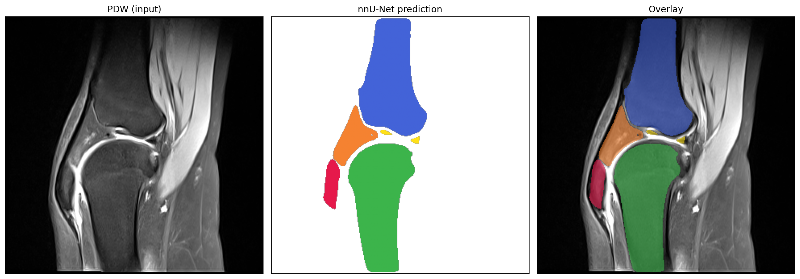

# Keen MRI Segmentation based on nnU-Net

Automatic segmentation of **knee osteoarthritis (OA) structures** from MRI using
[nnU-Net v2](https://github.com/MIC-DKFZ/nnUNet).

- **Modalities:** PDW + T2W (2 channels)
- **Targets:** Patella, Fat Pad, Meniscus, Femur, Tibia (5 structures + background)
- **Configuration:** `3d_fullres` · Trainer `nnUNetTrainer__nnUNetPlans__3d_fullres`
- **Trained with:** 5-fold cross-validation

## Segmentation Example



*Left: PDW input · Middle: nnU-Net prediction · Right: overlay*

## Repository Structure

| Path | Content |
|------|---------|
| `Mycodes/` | Data processing / analysis scripts |
| `nnUNet/`  | nnU-Net v2 source code |
| `assets/`  | Figures used in this README |

## Model & Data Release

A **released subset** (50 training cases + 5-fold nnU-Net weights, via Git LFS) is
published on the dedicated branch:

👉 [**`release-dataset`** branch](https://github.com/Herbert23H/Keen_MRI_Seg-based-on-nnUNet-/tree/release-dataset)

That branch contains its own `README.md` with:
- Repository layout (`nnUNet_raw` / `nnUNet_results`)
- Required environment variables
- Inference command (`nnUNetv2_predict`)
- Optional retraining instructions

## Quick Inference

```bash
pip install nnunetv2
git lfs pull   # after cloning the release-dataset branch

export nnUNet_raw=/path/to/release-dataset/nnUNet_raw
export nnUNet_results=/path/to/release-dataset/nnUNet_results

nnUNetv2_predict -i /path/to/input_dir -o /path/to/output_dir -d 002 -c 3d_fullres
```

Input cases must be named `<case>_0000.nii.gz` (PDW) and `<case>_0001.nii.gz` (T2W).

## License & Usage

Data and weights are provided for **research purposes only**. Please cite this
project if you use them, and contact the authors for clinical/commercial use.
